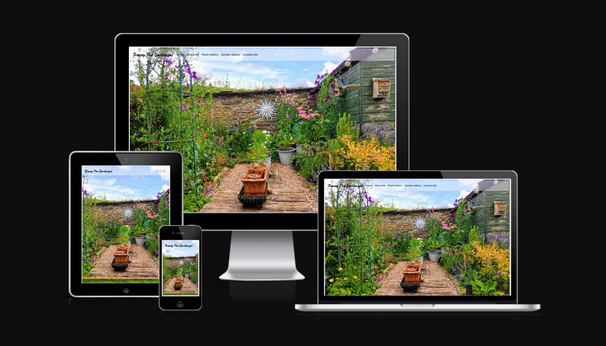
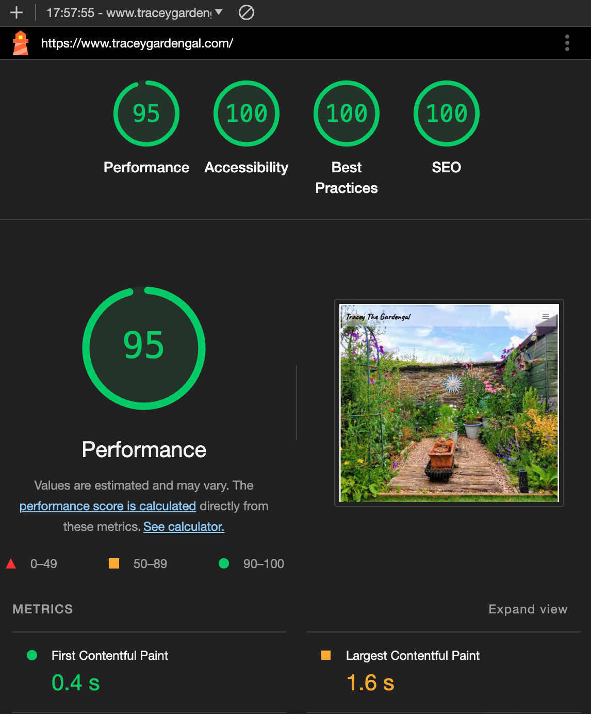
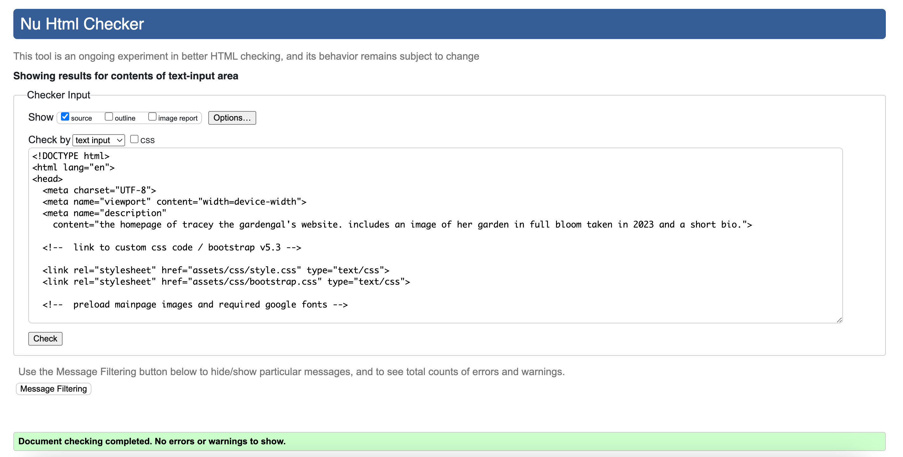
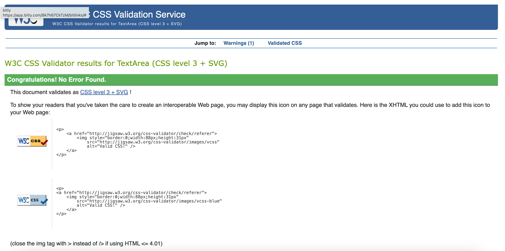



# Tracey the Gardengal v1.1

This is a revised version of my first ever website build. The remit was to build a 3-page minimum site using HTML and CSS. I have now redesigned and rebuilt the site from the ground up. 

The site can be viewed here: [www.traceygardengal.com](https://www.traceygardengal.com/)

The main changes from the original build are:

- A single page site with distinct parts rather than a 4-page site.
- Bootstrap carousels replace both the plant gallery and the garden gallery.
- The Facebook and Instagram icons are now embedded in the main body of the site rather than being in the footer. The email icon is reduced in size.
- A much smaller footer with a flowers icon behind it to the right makes for a cleaner look at the bottom of the page.
- A custom 404 error page. Much better than the default 404 page and has a link back to the traceygardengal site.
- Added a dismissable cookie statement as no cookies are used.
- The original embedded Google Map has been replaced with an embedded Google Map Javascript API
which doesn't use cookies.

## Technologies Used

- Bootstrap v5 CSS & Javascript library [Bootstrap v5.3](https://getbootstrap.com/)
- To create the favicon for the title bar, [favicon.io](https://favicon.io/favicon-generator/)
- Custom Google fonts [Google Fonts](https://fonts.google.com/)

## Media

- All images used were shot on my wife's iPhone 11 or my Nothing Phone(1).
- Credit to [Freepik at Flaticons.com](https://www.flaticon.com) for the Facebook, Instagram, Email, flower and 404 icons. Check them out. Awesome icons for free!

## Performance and Testing

- Google Lighthouse tests for Performance, Accessibility, Best Practices and SEO.

- Resource hint validator [DebugBear](https://www.debugbear.com/resource-hint-validator)
- W3C HTML Checker.

- W3C CSS Validation

## Original Project

The original site can be viewed here: [Tracey the Gardengal](https://github.com/thespamster/the-lady-gardener.git)